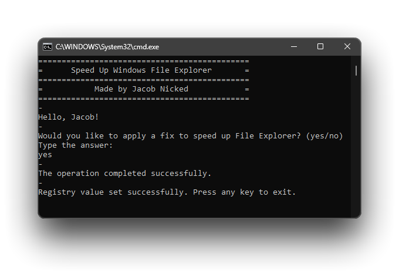

# Speed Up Windows File Explorer Tool

<p>Speed Up Windows File Explorer Tool speeds up File Explorer just in case, if Windows has not saved information about a folder before and tries to figure out what kind of folder it is (e.g., music, pictures, documents) by looking at every single file inside.</p>
<p>If the folder contains thousands of files, this process takes a very long time, making the folder load slowly and causing your hard disk drive (HDD) to work overtime.</p>

<hr>

If you want to create a registry file to apply a fix:
<ol>
  <li>Open a text editor program (e.g. Notepad).</li>
  <li>Have the code below copied and paste it into the text editor program.</li>
  <li>Save as a *.reg file, you can name it whatever you want to.</li>
  <li>Open the file and confirm changes.
    <ul>
      <li>A restart of File Explorer or your PC might be required.</li>
    </ul>
  </li>
</ol>

```
Windows Registry Editor Version 5.00

[Computer\HKEY_CURRENT_USER\SOFTWARE\Classes\Local Settings\Software\Microsoft\Windows\Shell\Bags\AllFolders\Shell]
"FolderType"="NotSpecified"
```
<br>
